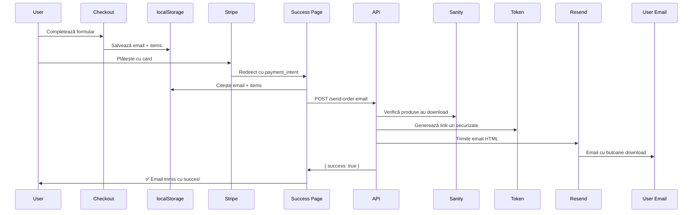

# SOLUȚIE AUTO-DOWNLOAD FĂRĂ WEBHOOK

## ❌ Problema Inițială

Webhook-ul Stripe **NU SE DECLANȘEAZĂ AUTOMAT** în development:

- Stripe nu trimite evenimente automat către `localhost`
- Trebuie Stripe CLI cu `stripe listen --forward-to localhost:3000/api/webhooks`
- Email-ul NU SE TRIMITE pentru că webhook-ul nu rulează

## ✅ Soluția Implementată: Direct de pe Success Page

Am modificat sistemul să trimită emailul **DIRECT** după plată, fără să aștepte webhook-ul.

### Cum Funcționează Acum:

```
1. User completează checkout → plătește cu Stripe
2. Stripe redirectează către /checkout/success?payment_intent=pi_xxx
3. Success page citește:
   - payment_intent din URL
   - Email din localStorage (salvat la checkout)
   - Produse din localStorage (salvate la checkout)
4. Success page TRIMITE EMAIL prin /api/send-order-email
5. User vede mesaj de confirmare instantaneu
```

### Fișiere Modificate:

#### 1. **app/api/send-order-email/route.ts** (NOU)

Endpoint care:

- Primește payment_intent, email, items
- Generează link-uri de download securizate
- Trimite email cu template HTML profesional
- NU depinde de webhook Stripe

#### 2. **app/checkout/success/page.tsx** (MODIFICAT)

Client component care:

- Citește `payment_intent` din URL
- Citește email și produse din localStorage
- Apelează `/api/send-order-email` automat
- Afișează status (loading → success → error)
- Curăță localStorage după succes

#### 3. **app/checkout/page.tsx** (MODIFICAT)

Salvează date în localStorage înainte de plată:

```typescript
localStorage.setItem('korgpa_checkout_email', email);
localStorage.setItem('korgpa_cart', JSON.stringify(items));
```

## 🚀 Testare

### Pasul 1: Configurează Resend API Key

**IMPORTANT:** `RESEND_API_KEY` este placeholder! Trebuie cheie REALĂ:

```bash
# Mergi la: https://resend.com/api-keys
# Creează cont gratuit (100 email-uri/zi)
# Copiază API key (începe cu re_...)
# Actualizează în .env.local:
RESEND_API_KEY=re_cheie_reala_aici
```

### Pasul 2: Configurează Adresa Email FROM

În `.env.local`, adaugă:

```bash
RESEND_FROM_EMAIL=comenzi@tudomeniu.com  # SAU onboarding@resend.dev
```

**Note:**

- Pentru teste: folosește `onboarding@resend.dev`
- Pentru producție: verifică domeniul în Resend

### Pasul 3: Testează Plata

1. Rulează server: `npm run dev`
2. Adaugă produse în coș
3. Mergi la Checkout
4. Completează formular cu **EMAIL REAL** (al tău)
5. Plătește cu card test: `4242 4242 4242 4242`
6. Vei vedea pe success page:
   - ⏳ "Se trimite emailul..." (loading)
   - ✅ "Email trimis cu succes!" (succes)
   - ⚠️ "Email temporar indisponibil" (eroare)

### Pasul 4: Verifică Email

- Verifică inbox-ul (email-ul introdus la checkout)
- Verifică folder Spam/Junk
- Email-ul conține:
  - Header gradient profesional
  - Tabel cu produse comandate
  - Butoane de download pentru fiecare produs
  - Link-uri valide 30 zile

## 📝 Avantaje vs Webhook

| Aspect      | Webhook                 | Success Page API          |
| ----------- | ----------------------- | ------------------------- |
| Configurare | Stripe CLI necesar      | NU trebuie nimic          |
| Development | `stripe listen...`      | Funcționează direct       |
| Rapiditate  | După confirmare Stripe  | INSTANT după redirect     |
| Debugging   | Greu (evenimente async) | Ușor (vezi în console)    |
| Reliability | Retry automat           | User vede imediat eroarea |

## 🔧 Debugging

### Verifică Console Browser (F12)

```javascript
// Dacă vezi eroare "Cart or email data missing":
localStorage.getItem('korgpa_checkout_email'); // null? → problemă
localStorage.getItem('korgpa_cart'); // null? → problemă

// Dacă datele lipsesc, emailul nu se poate trimite
```

### Verifică Terminal Server

```bash
# La plată reușită, vei vedea:
POST /api/send-order-email 200

# Dacă apare eroare:
❌ Eroare la trimitere email: Invalid API key
# → Verifică RESEND_API_KEY în .env.local
```

### Testează Direct API-ul

```bash
curl -X POST http://localhost:3000/api/send-order-email \
  -H "Content-Type: application/json" \
  -d '{
    "paymentIntentId": "pi_test_123",
    "email": "tau@email.com",
    "items": [
      {"id": "abc", "name": "KORG PA700", "price": 1299, "quantity": 1}
    ]
  }'
```

## 🎯 Ce TREBUIE Pentru Funcționare

1. ✅ **RESEND_API_KEY** REAL în `.env.local`
2. ✅ **RESEND_FROM_EMAIL** configurat
3. ✅ **DOWNLOAD_TOKEN_SECRET** generat (deja există)
4. ✅ **NEXT_PUBLIC_BASE_URL** pentru link-uri (deja există)
5. ✅ Produse au `downloadFile` SAU `downloadUrl` în Sanity
6. ✅ Email REAL la checkout (nu `test@test.com`)

## 🚨 Probleme Comune

### 1. Email NU Sosește

**Cauze:**

- RESEND_API_KEY placeholder → ia cheie reală
- Email incorect la checkout → verifică
- Folder Spam → verifică Junk/Spam
- Resend limit (100/zi gratuit) → verifică dashboard

### 2. "Cart or email data missing"

**Cauze:**

- localStorage blocat de browser → verifică setări privacy
- Plată din altă sesiune → folosește același browser
- Cache → refresh hard (Ctrl+Shift+R)

### 3. Link-uri Download NU Funcționează

**Cauze:**

- Produse FĂRĂ `downloadFile`/`downloadUrl` în Sanity
- DOWNLOAD_TOKEN_SECRET lipsă → verifică .env.local
- Token expirat (30 zile) → regenerează

## 📊 Flow Complet



## 🎉 Rezultat Final

După configurare corectă:

1. ✅ User plătește → redirect instant către success
2. ✅ Email se trimite AUTOMAT în 1-2 secunde
3. ✅ Success page arată confirmare vizuală
4. ✅ User primește email cu link-uri download
5. ✅ Link-uri funcționează 30 zile
6. ✅ NU TREBUIE Stripe CLI în development
7. ✅ NU TREBUIE webhook forwarding

## 🔐 Securitate

- ✅ Token-uri base64url cu HMAC SHA-256
- ✅ Valabilitate limitată (30 zile)
- ✅ Verificare payment_intent în token
- ✅ Verificare produs în Sanity la download
- ✅ Rate limiting implicit de Resend

---

**Creat:** 2025
**Update:** Soluție workaround pentru development fără Stripe CLI
